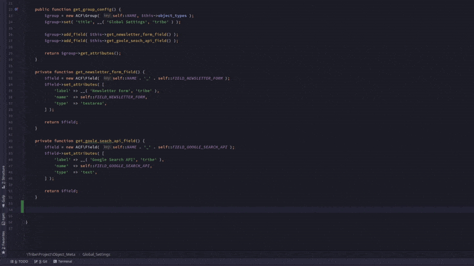

# SquareOne Live Templates for PhpStorm

### Installation

1. Go to _File | Manage IDE Settings | Settings Repository_
1. Add Read-Only Source https://github.com/moderntribe/squareone-phpstorm-live-templates
1. Restart PhpStorm
1. Start typing _acf..._